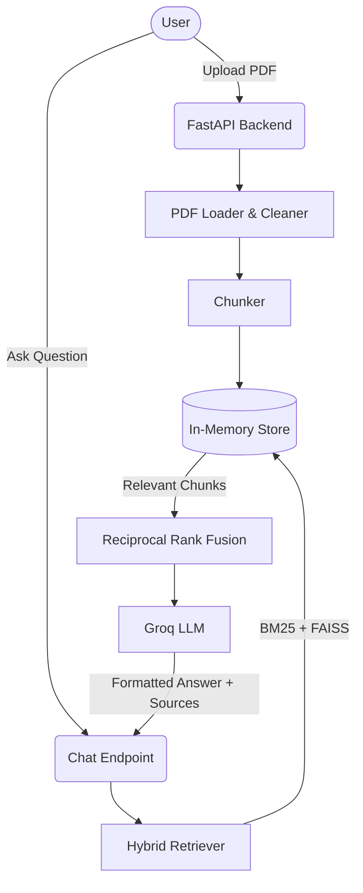

# CapyDocs

CapyDocs is a beautiful, open-source "chat with your PDF" web application. It combines a robust RAG (Retrieval-Augmented Generation) backend with a cute, responsive frontend featuring "Papr" the animated capybara mascot. 

## Features
- **Cloud AI**: Runs on Groq. The default `llama-3.3-70b-versatile` model runs on Groq's servers, so the parts of your PDF used to answer are sent there. (Ollama also supported via config).
- **Intelligent RAG**: Features Hybrid BM25 + Vector Search with Reciprocal Rank Fusion (RRF), map-reduce summarization, and positional heuristics.
- **Smart Sourcing**: Answers include precise page references, allowing you to instantly jump to the source in the built-in PDF viewer.
- **Tailored Answers**: Choose a "purpose" (Student, Work, Research, General) to dynamically adjust the LLM's response style.
- **Papr the Capybara**: A pixel-art capybara mascot that reacts to your cursor using sprite sheets, reads along while you upload, and gets impatient if you idle!

*(Screenshots of Papr's various animated states will be placed here)*

**Live Demo**: [Vercel URL] (Frontend) | https://capydocs.onrender.com (Backend API)

## Architecture

## Tech Stack
- **Frontend**: Vite, React, Tailwind CSS v4, Framer Motion
- **Fonts**: [Fredoka](https://fontsource.org/fonts/fredoka), [Nunito](https://fontsource.org/fonts/nunito), and [Pixelify Sans](https://fontsource.org/fonts/pixelify-sans) under the SIL Open Font License.
- **Backend**: FastAPI, Python 3.12, Pytest
- **AI**: Groq (llama-3.3-70b-versatile by default), LangChain

## Setup Instructions

### Prerequisites
Python 3.11 or newer, Node.js 20 or newer, and Ollama on Windows.

Cloud model (works on any laptop, needs a free Groq API key). You can also use Ollama if configured.

### 2. Install the backend
    python -m venv .venv
    .\.venv\Scripts\activate
    pip install -r backend\requirements.txt

### 3. Configure
    copy backend\.env.example backend\.env
    copy frontend\.env.example frontend\.env
Open backend\.env and set LLM_PROVIDER=groq, LLM_MODEL=llama-3.3-70b-versatile, and GROQ_API_KEY.
The frontend .env should contain VITE_API_URL=http://127.0.0.1:8000.

### 4. Install the frontend
    cd frontend
    npm install
    cd ..

### 5. Run everything
    .\start-dev.ps1
Then open http://localhost:5173 in your browser.

### Troubleshooting
**[WinError 3] The system cannot find the path specified (during pip install):**
Windows has a legacy 260-character limit on file paths. If you cloned CapyDocs to a deep folder (like your Desktop), some Python packages won't install. 
**Solution:**
Clone the repository into a shorter path, such as `C:\dev\CapyDocs`.
*Optionally*, you can also enable long paths in Git and Windows:
`git config --global core.longpaths true`

## Privacy Note
CapyDocs sends your question and the most relevant excerpts of your PDF (not
the whole file) to the model to produce an answer. The Summary feature is
different: it sends the whole document, in pieces. With a cloud model such as the default
Groq `llama-3.3-70b-versatile`, it is sent to Groq's servers. Uploaded PDFs are kept in
memory only and are never saved to disk. Don't upload documents you wouldn't
want a model provider to see unless you configure a local provider.

## Limitations
- **Scanned PDFs & Tables**: OCR is not currently supported. Complex tables may not parse cleanly.
- **In-Memory Storage**: The document index lives in memory. Restarting the server clears uploaded documents.
- **Small Models**: Local models (like Gemma or Llama3-8B) may hallucinate or fail complex reasoning compared to massive cloud models.

## Roadmap
- [ ] Real-time text streaming
- [ ] User authentication and login
- [ ] Persistent database (Postgres/SQLite) for chat history
- [ ] Test-mode payment integration
- [ ] Advanced custom system prompts

## Deploying to Render (Free Tier)
CapyDocs is configured for zero-cost deployment on Render's Free tier, connecting to Ollama's Cloud API for inference.

### Architecture
- **Frontend**: A static React build deployed via a static site host (e.g., Vercel, Netlify, or Render Static Web).
- **Backend**: A Dockerized FastAPI Python app running on Render's Web Service (Free Tier).
- **Inference**: All chat/summary generation relies on the external Groq API (or Ollama if configured).
- **Retrieval Modes**: Production on Render uses `bm25` (pure keyword matching) to stay within memory limits. Hybrid search with vector embeddings and Reciprocal Rank Fusion is available through the `EMBEDDING_BACKEND=fastembed` setting.

### Environment Variables
Set these on your backend host:
- `LLM_PROVIDER`: `groq` (or `ollama`)
- `LLM_MODEL`: E.g., `llama-3.3-70b-versatile`.
- `GROQ_API_KEY`: Your Groq Cloud key (e.g., `gsk_...`). Keep this secret (`sync: false`).
- `EMBEDDING_BACKEND`: `bm25` (default in production), `fastembed` (~200MB memory footprint), or `local`.
- `CORS_ORIGINS`: Comma-separated list of allowed frontend URLs.
- *Rate Limits*: `MAX_UPLOADS_PER_HOUR`, `MAX_CHATS_PER_HOUR`, `MAX_SUMMARIES_PER_HOUR`, `MAX_CONCURRENT_SUMMARIES`.
- *Caps*: `MAX_PAGE_COUNT`, `REQUEST_TIMEOUT`.

### Free-Tier Limitations
- **Cold Starts**: Render spins down free containers after 15 minutes of inactivity. When you upload your first PDF, the server may take ~50 seconds to wake up (Papr will show a "waking up" banner).
- **Memory Limits**: The free tier provides 512 MB of RAM. Using the `fastembed` backend guarantees the footprint stays under ~300 MB. Do not use `local` (PyTorch) on the free tier.
- **Ephemeral Storage**: All uploads and in-memory embeddings are lost when the container sleeps. Papr handles this gracefully: he will "doze off" and prompt you to re-upload.

### Privacy Note
**Caution**: When deployed, uploaded PDFs and chat questions are sent externally to the model provider (Groq) for processing. Do not upload sensitive, personal, or confidential documents.

## Credits
- **Fonts**: [Fredoka](https://fontsource.org/fonts/fredoka), [Nunito](https://fontsource.org/fonts/nunito), and [Pixelify Sans](https://fontsource.org/fonts/pixelify-sans) are used under the SIL Open Font License.
- **Mascot Art**: The pixel-art capybara sprites (`capy_directions.png` and `capy_reactions.png`) have an unknown source and license. If you know the original artist, please open an issue so we can properly credit them!
