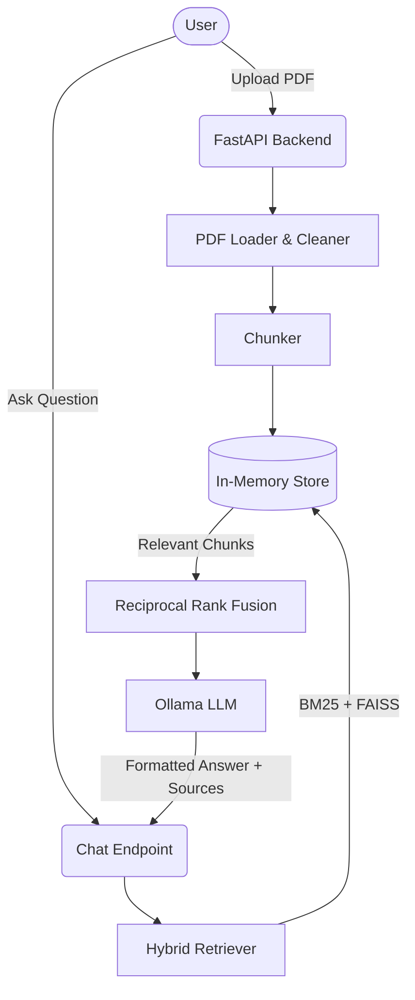

# CapyDocs

CapyDocs is a beautiful, open-source "chat with your PDF" web application. It combines a robust RAG (Retrieval-Augmented Generation) backend with a cute, responsive frontend featuring "Papr" the animated capybara mascot. 

## Features
- **Local AI Privacy**: Powered by Ollama, all inference runs entirely on your local machine. No data is sent to the cloud!
- **Intelligent RAG**: Features Hybrid BM25 + Vector Search with Reciprocal Rank Fusion (RRF), map-reduce summarization, and positional heuristics.
- **Smart Sourcing**: Answers include precise page references, allowing you to instantly jump to the source in the built-in PDF viewer.
- **Tailored Answers**: Choose a "purpose" (Student, Work, Research, General) to dynamically adjust the LLM's response style.
- **Papr the Capybara**: A fully interactive SVG React mascot that reacts to your cursor, reads along while you upload, and gets impatient if you idle!

## Architecture



## Tech Stack
- **Frontend**: Vite, React, Tailwind CSS v4, Framer Motion
- **Backend**: FastAPI, Python 3.12, Pytest
- **AI**: Ollama (gemma4:cloud by default), LangChain

## Setup Instructions

### 1. Install Ollama
Ensure you have [Ollama](https://ollama.com/) installed and running on your system. 
```bash
ollama run gemma4:cloud
```

### 2. Environment Variables
Create a `.env` file in the `frontend` directory:
```
VITE_API_URL=http://127.0.0.1:8000
```

### 3. One-Command Start (Windows)
We've provided a simple PowerShell script to boot up the entire stack. From the root of the project, run:
```bash
.\start-dev.ps1
```
This will automatically verify Ollama is running, launch the backend API in one window, and start the Vite frontend in another.

## Privacy Note
CapyDocs is configured by default to run locally via Ollama, ensuring zero data leakage. If you modify `.env` to use a cloud provider (like OpenAI or Anthropic), please note that **retrieved text from your PDFs will be sent to the model provider**.

## Limitations
- **Scanned PDFs & Tables**: OCR is not currently supported. Complex tables may not parse cleanly.
- **In-Memory Storage**: The document index lives in memory. Restarting the server clears uploaded documents.
- **Small Models**: Local models (like Gemma or Llama3-8B) may hallucinate or fail complex reasoning compared to massive cloud models.

## Roadmap
- [ ] Real-time text streaming
- [ ] User authentication and login
- [ ] Persistent database (Postgres/SQLite) for chat history
- [ ] Test-mode payment integration
- [ ] Advanced custom system prompts
